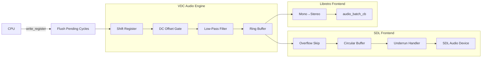

# Design Document: Cycle-Accurate Audio

## Overview

This design improves the Videopac emulator's audio subsystem to achieve cycle-accurate sound reproduction. The changes span three layers: the VDC audio engine (flush-before-write, DC offset elimination, low-pass filter, sample rate), the SDL frontend (precise frame pacing, overflow skip, underrun handling), and the libretro frontend (sample rate update).

The core insight is that mid-frame sound register writes currently take effect at the wrong time — the VDC applies new register values immediately but doesn't generate samples for the cycles that elapsed under the old state. Flushing pending audio cycles before each sound register write fixes this. The remaining changes address signal quality (DC offset, filtering), timing (frame pacing), and buffer robustness (overflow/underrun).

## Architecture

The audio pipeline flows through three stages:

```
VDC Audio Engine → Ring Buffer → Frontend Output
```



Changes are isolated to their respective layers:
- VDC layer: flush logic, DC offset tracking, low-pass filter, 48kHz default
- SDL layer: performance counter pacing, overflow skip, underrun hold
- Libretro layer: 48kHz constants

No new classes are introduced. All changes are additions to existing structs and methods.

## Components and Interfaces

### VDC Audio Engine (vdc.h / vdc.cpp)

#### New VDCState Fields

```cpp
// DC offset detection
uint32 cycles_since_toggle;    // VDC cycles since shift register output bit last changed
uint8 previous_output_bit;     // Previous value of shift register bit 0

// Low-pass filter
int16 audio_filter_state;      // Previous filtered sample (IIR state)
```

#### New VDC Methods

```cpp
// Flush all pending audio cycles before a sound register write.
// Generates samples at the current shift register state, then resets
// the cycle accumulator so the new register value takes effect cleanly.
void flush_audio_cycles();
```

#### Modified Methods

`write_register(uint8 address, uint8 value)`:
- Before processing SOUND0, SOUND1, SOUND2, or SOUND_CONTROL writes, call `flush_audio_cycles()`.

`update_audio()`:
- After shifting the register, check if bit 0 changed. If so, reset `cycles_since_toggle` to 0. Otherwise, increment it.

`get_audio_sample()`:
- If `cycles_since_toggle > 2000`, return 0 instead of the volume-scaled sample.

`capture_audio_sample()`:
- After computing the raw sample via `get_audio_sample()`, apply the low-pass filter:
  `filtered = audio_filter_state + (raw - audio_filter_state) * 3 / 205`
- Store `filtered` as the new `audio_filter_state`.
- Write `filtered` (not `raw`) into the ring buffer.

`reset()`:
- Initialize `cycles_since_toggle = 0`, `previous_output_bit = 0`, `audio_filter_state = 0`.
- Change default `audio_sample_rate_` from 44100 to 48000.

`set_audio_sample_rate()`:
- No interface change, but default call site passes 48000.

#### flush_audio_cycles() Implementation

```cpp
void VDC::flush_audio_cycles() {
    // Run update_audio() + capture_audio_sample() for all accumulated
    // VDC cycles that haven't yet been processed for audio output.
    // This is called from write_register() before applying the new value,
    // ensuring samples are generated under the old register state.
    //
    // The audio_cycle_accumulator tracks sub-shift-period progress.
    // The audio_sample_accumulator tracks sub-sample-period progress.
    // Both are left in their current state — they represent fractional
    // progress that carries forward after the register write.
    //
    // If no cycles have elapsed (accumulator is 0), this is a no-op.
}
```

The actual work is already done by `update_audio()` and `capture_audio_sample()` — the flush just needs to ensure any pending fractional cycles are resolved before the register write. Since `update_audio()` and `capture_audio_sample()` are called every VDC cycle in `tick_one_cycle()`, the accumulators are always up-to-date at the point of a CPU write. The flush is effectively a synchronization point: it doesn't need to run extra cycles, because the cycle-accurate loop already called `update_audio()` and `capture_audio_sample()` for every VDC tick up to the current point. The key change is that `write_register()` must apply the register value *after* the current cycle's audio has been captured, not before.

Reordering: In `write_register()`, for sound registers, the flush call ensures the current tick's audio processing (which already happened in `tick_one_cycle()`) used the old values. The new value is then written to `state_.registers[address]` and decoded into the internal fields. This means the next VDC tick will use the new values.

### SDL Frontend (frontend_sdl.h / frontend_sdl.cpp)

#### New Fields

```cpp
// Precise frame pacing
uint64_t frame_start_counter_;     // SDL_GetPerformanceCounter at frame start
uint64_t perf_frequency_;          // SDL_GetPerformanceFrequency (cached)

// Underrun handling
int16 last_audio_sample_;          // Last successfully read sample
```

#### Modified Methods

`init_audio()`:
- Change `desired_spec.freq` from `config_.sample_rate` to 48000.

`process_audio()`:
- After writing samples to the circular buffer, check queued sample count.
- If queued > 3 frames worth (3 * 800 for NTSC, 3 * 960 for PAL), advance `audio_read_pos_` until queued ≤ 1 frame worth.

`audio_callback()`:
- On successful read, store sample in `last_audio_sample_`.
- On underrun (buffer empty), output `last_audio_sample_` instead of 0.

Main loop frame pacing:
- Replace `SDL_Delay()` with a spin-wait loop using `SDL_GetPerformanceCounter()`.
- Cache `SDL_GetPerformanceFrequency()` once at init.
- Target: 16.67ms (NTSC) or 20.0ms (PAL).
- Skip pacing entirely when `turbo_mode_` is active.

### Libretro Frontend (libretro.cpp)

#### Modified Constants

```cpp
static constexpr size_t AUDIO_SAMPLES_PER_FRAME_NTSC = 800;  // 48000/60
static constexpr size_t AUDIO_SAMPLES_PER_FRAME_PAL = 960;   // 48000/50
```

#### Modified Functions

`retro_get_system_av_info()`:
- Change `info->timing.sample_rate` from 44100.0 to 48000.0.

### FrontendConfig (frontend.h)

#### Modified Default

```cpp
sample_rate(48000)  // was 44100
```

## Data Models

### VDCState Additions

| Field | Type | Default | Description |
|-------|------|---------|-------------|
| `cycles_since_toggle` | `uint32` | 0 | VDC cycles since shift register bit 0 last changed value |
| `previous_output_bit` | `uint8` | 0 | Previous value of shift register bit 0, for change detection |
| `audio_filter_state` | `int16` | 0 | IIR low-pass filter state (previous filtered output) |

These fields are added to `VDCState` so they are included in save/restore operations automatically.

### SDLFrontend Additions

| Field | Type | Default | Description |
|-------|------|---------|-------------|
| `frame_start_counter_` | `uint64_t` | 0 | Performance counter value at frame start |
| `perf_frequency_` | `uint64_t` | 0 | Cached SDL_GetPerformanceFrequency result |
| `last_audio_sample_` | `int16` | 0 | Last sample read from buffer, used during underrun |

### Constants Changed

| Constant | Old Value | New Value | Location |
|----------|-----------|-----------|----------|
| `audio_sample_rate_` default | 44100 | 48000 | vdc.cpp reset() |
| `FrontendConfig::sample_rate` | 44100 | 48000 | frontend.h |
| `AUDIO_SAMPLES_PER_FRAME_NTSC` | 735 | 800 | libretro.cpp |
| `AUDIO_SAMPLES_PER_FRAME_PAL` | 882 | 960 | libretro.cpp |
| `timing.sample_rate` | 44100.0 | 48000.0 | libretro.cpp |


## Correctness Properties

*A property is a characteristic or behavior that should hold true across all valid executions of a system — essentially, a formal statement about what the system should do. Properties serve as the bridge between human-readable specifications and machine-verifiable correctness guarantees.*

### Property 1: Flush preserves old shift register state in samples

*For any* VDC state with audio enabled and any sound register write, all audio samples captured before the write takes effect shall reflect the shift register pattern, volume, and frequency that were active before the write — not the new values.

**Validates: Requirements 1.1, 1.2**

### Property 2: DC offset toggle counter tracks correctly

*For any* sequence of VDC ticks with audio enabled, `cycles_since_toggle` shall equal the number of VDC cycles since the shift register output bit (bit 0) last changed value. When bit 0 changes, the counter resets to zero; otherwise it increments by one per tick.

**Validates: Requirements 2.1, 2.2**

### Property 3: DC offset gate suppresses static output

*For any* VDC audio state, if `cycles_since_toggle` exceeds 2000, `get_audio_sample()` shall return 0. If `cycles_since_toggle` is at most 2000 and audio is enabled with non-zero volume, `get_audio_sample()` shall return a non-zero volume-scaled value. When the output bit subsequently changes, `cycles_since_toggle` resets and non-zero output resumes immediately.

**Validates: Requirements 2.3, 2.4**

### Property 4: Low-pass filter computes correct IIR output

*For any* sequence of raw audio samples, the filtered output at each step shall equal `previous_filtered + (raw - previous_filtered) * 3 / 205`, where `previous_filtered` is the filter output from the preceding sample (or 0 after reset).

**Validates: Requirements 3.1, 3.2, 3.3**

### Property 5: Overflow skip bounds queued audio

*For any* SDL audio buffer state where the number of queued samples exceeds 3 frames worth (3 × 800 for NTSC, 3 × 960 for PAL), after `process_audio()` completes, the number of queued samples shall be at most 1 frame worth.

**Validates: Requirements 5.2, 5.3**

### Property 6: Underrun holds last sample

*For any* SDL audio callback invocation where the circular buffer is empty, the output shall be the last sample successfully read from the buffer (not zero). When the buffer has samples available again, reading resumes normally.

**Validates: Requirements 6.1, 6.2, 6.3**

## Error Handling

### Audio Buffer Overflow
When the ring buffer in VDCState is full (`audio_sample_count >= AUDIO_BUFFER_SIZE`), `capture_audio_sample()` silently drops samples. This is unchanged — the SDL overflow skip (Requirement 5) handles the frontend side.

### Audio Buffer Underrun
The SDL `audio_callback` currently outputs silence (0) on underrun. This changes to outputting `last_audio_sample_` — the last successfully read value. This avoids clicks/pops from sudden zero transitions.

### Flush with No Pending Cycles
When `flush_audio_cycles()` is called but no VDC cycles have elapsed since the last audio capture (accumulator is zero), the function is a no-op. No additional samples are generated. This handles the edge case of back-to-back register writes within the same VDC cycle.

### Filter State on Reset
`audio_filter_state` is reset to 0 on `VDC::reset()`, ensuring no stale filter state bleeds across game loads or resets.

### Integer Overflow in Filter
The IIR computation `previous_filtered + (raw - previous_filtered) * 3 / 205` uses int16 values. The intermediate `(raw - previous_filtered)` can range from -65534 to +65534, and `* 3` can reach ±196602, which fits in int32. The division by 205 brings it back to int16 range. The computation must use int32 intermediates to avoid overflow.

## Testing Strategy

### Property-Based Testing

Use [Rapidcheck](https://github.com/emil-e/rapidcheck) as the property-based testing library (already compatible with the project's Google Test setup).

Each property test runs a minimum of 100 iterations with randomly generated inputs.

Each test is tagged with a comment referencing its design property:
```
// Feature: cycle-accurate-audio, Property N: <property text>
```

Each correctness property maps to a single property-based test:

1. **Property 1 (Flush preserves old state)**: Generate random shift register values, volumes, frequencies, and a write timing. Run VDC ticks, perform a register write, and verify all samples before the write match the old configuration.

2. **Property 2 (Toggle counter)**: Generate random 24-bit shift register patterns and tick counts. Run `update_audio()` for each tick and verify `cycles_since_toggle` matches the expected count since the last bit-0 change.

3. **Property 3 (DC offset gate)**: Generate random VDC states with varying `cycles_since_toggle` values (above and below 2000). Call `get_audio_sample()` and verify the output is 0 when counter > 2000, and non-zero otherwise (when audio enabled with non-zero volume).

4. **Property 4 (Low-pass filter)**: Generate random sequences of int16 raw samples. Apply the IIR formula step by step and verify the filter output matches `previous + (raw - previous) * 3 / 205` at each step.

5. **Property 5 (Overflow skip)**: Generate random circular buffer states with varying fill levels (including > 3 frames). Run the overflow skip logic and verify the resulting queued count is ≤ 1 frame worth.

6. **Property 6 (Underrun hold)**: Generate random `last_audio_sample_` values and simulate an empty buffer callback. Verify the output equals the last sample, not zero.

### Unit Tests

Unit tests complement property tests for specific examples and edge cases:

- **Flush no-op**: Write a sound register with zero accumulated cycles, verify sample count unchanged (edge case from 1.3).
- **Filter reset**: Call `reset()`, verify `audio_filter_state` is 0 (example from 3.4).
- **Sample rate constants**: Verify VDC default is 48000, libretro constants are 800/960, libretro sample rate is 48000.0 (examples from 7.1, 7.3, 7.4, 7.5).
- **DC offset threshold boundary**: Test at exactly 2000 cycles (output non-zero) and 2001 cycles (output zero).
- **Filter with zero input**: Verify filter converges toward zero from a non-zero state.
- **Back-to-back register writes**: Two writes in the same VDC cycle, verify only one flush occurs and no duplicate samples.
