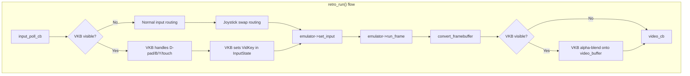

# Design Document: Libretro Enhancements

## Overview

This design covers three enhancements to the videopac libretro core:

1. **Virtual On-Screen Keyboard** — A programmatically rendered overlay giving gamepad/touch users access to all 49 Odyssey 2 keyboard keys. Toggled via SELECT, navigated via D-pad, keys pressed via B button or touch. Supports configurable transparency and top/bottom positioning.
2. **Joystick Port Swap** — A core option to swap port 0/1 joystick routing for games that expect player 1 on the right controller port.
3. **Info File Updates** — Additional BIOS entries (C52, G7400, Jopac) and version bump to 0.3.0.

All rendering is programmatic (filled rectangles + built-in bitmap font) to keep the core self-contained with no external image assets. The framebuffer is XRGB8888 at 160×240. The core remains SDL-free.

## Architecture

The virtual keyboard is implemented as a self-contained module (`vkeyboard.h` / `vkeyboard.cpp`) that lives alongside the core library. It has no dependencies on SDL or the libretro API — it operates purely on pixel buffers and input state.



### Module Boundaries

| Module | Responsibility |
|--------|---------------|
| `vkeyboard.h/.cpp` | Key layout table, cursor state, rendering, navigation, hit testing, alpha blending |
| `vkeyboard_font.h` | Built-in 5×7 bitmap font data (constexpr array) |
| `libretro.cpp` | Integration: toggle logic, input routing, option handling, calling VKB render |
| `libretro.h` | Add `RETRO_DEVICE_POINTER` constants for touch support |
| `videopac_libretro.info` | BIOS entries and version bump |

### Integration Points in `retro_run()`

The current `retro_run()` calls `update_input()` → `run_frame()` → `convert_framebuffer()` → `video_cb()`. The enhanced flow inserts VKB logic at two points:

1. **Input phase** (inside `update_input()`): If VKB is visible, intercept D-pad/B/Y from port 0 for navigation/press/position, and check touch via `RETRO_DEVICE_POINTER`. SELECT toggles visibility regardless of VKB state.
2. **Render phase** (after `convert_framebuffer()`): If VKB is visible, call `vkb.render(video_buffer)` to alpha-blend the overlay.

## Components and Interfaces

### VirtualKeyboard Class

```cpp
// include/vkeyboard.h
namespace videopac {

struct VKBKey {
    const char* label;      // Display text (e.g. "Q", "SPC", "ENT")
    uint8 x, y;             // Position in VKB-local coordinates
    uint8 width, height;    // Key dimensions in pixels
    VidKey vidkey;           // Corresponding keyboard matrix entry
    int8_t nav_up;          // Index of key above (-1 = none)
    int8_t nav_down;        // Index of key below (-1 = none)
    int8_t nav_left;        // Index of key to left (-1 = none)
    int8_t nav_right;       // Index of key to right (-1 = none)
};

class VirtualKeyboard {
public:
    VirtualKeyboard();

    // State
    bool is_visible() const;
    void toggle_visible();
    void toggle_position();       // Swap top/bottom

    // Navigation (D-pad)
    void move_cursor(Direction dir);
    int  get_cursor_index() const;

    // Key press (returns VidKey of current cursor key)
    VidKey get_current_vidkey() const;

    // Touch hit testing
    // Returns index into layout table, or -1 if no hit
    int hit_test(int vkb_local_x, int vkb_local_y) const;
    VidKey get_vidkey_at(int index) const;

    // Rendering
    // Blends VKB overlay onto an XRGB8888 buffer of FRAMEBUFFER_WIDTH × FRAMEBUFFER_HEIGHT
    void render(uint32_t* framebuffer, int fb_width, int fb_height,
                uint8_t transparency_pct) const;

    // Layout access (for testing)
    static constexpr int KEY_COUNT = 49;
    static const VKBKey LAYOUT[KEY_COUNT];

    // VKB dimensions
    static constexpr int VKB_WIDTH = 160;   // Matches framebuffer width
    static constexpr int VKB_HEIGHT = 80;   // Compact overlay height

private:
    bool visible_ = false;
    bool position_bottom_ = true;  // true = bottom, false = top
    int cursor_index_ = 0;

    // Internal rendering helpers
    void draw_rect(uint32_t* fb, int fb_width, int fb_height,
                   int x, int y, int w, int h, uint32_t color,
                   uint8_t alpha) const;
    void draw_char(uint32_t* fb, int fb_width, int fb_height,
                   int x, int y, char ch, uint32_t color,
                   uint8_t alpha) const;
    void draw_label(uint32_t* fb, int fb_width, int fb_height,
                    int x, int y, const char* text, uint32_t color,
                    uint8_t alpha) const;
    int  get_vkb_y_offset(int fb_height) const;
};

} // namespace videopac
```

### Bitmap Font

```cpp
// include/vkeyboard_font.h
namespace videopac {

// 5×7 bitmap font for printable ASCII (32-127)
// Each character is 7 bytes, one per row, 5 bits per row (MSB-aligned)
constexpr int FONT_CHAR_WIDTH = 5;
constexpr int FONT_CHAR_HEIGHT = 7;
extern const uint8_t FONT_DATA[96][7];  // 96 printable chars × 7 rows

} // namespace videopac
```

### Pointer Device Constants

The libretro header needs `RETRO_DEVICE_POINTER` and its ID constants for touch support:

```cpp
// Added to include/libretro.h
#define RETRO_DEVICE_POINTER  6

#define RETRO_DEVICE_ID_POINTER_X       0
#define RETRO_DEVICE_ID_POINTER_Y       1
#define RETRO_DEVICE_ID_POINTER_PRESSED 2
```

The frontend reports pointer coordinates in the range [-0x7FFF, 0x7FFF] mapping to the full framebuffer area. The core translates these to pixel coordinates for hit testing.

### Joystick Swap

No new class needed. A `static bool swap_joysticks` flag in `libretro.cpp` controls routing in `update_input()`. When enabled, port 0 joypad → `joystick2[]` and port 1 joypad → `joystick1[]`.

### Core Options Update

```cpp
static struct retro_variable core_options[] = {
    { "videopac_region", "Region; NTSC|PAL" },
    { "videopac_palette", "Palette; Standard|Videopac+" },
    { "videopac_vkbd_transparency", "Virtual Keyboard Transparency; 25%|0%|50%|75%" },
    { "videopac_swap_joysticks", "Swap Joysticks; disabled|enabled" },
    { nullptr, nullptr }
};
```

The default value is the first item after the semicolon in libretro option format, so "25%" is the default for transparency and "disabled" for swap.

### Input Descriptor Updates

```cpp
static struct retro_input_descriptor desc[] = {
    { 0, RETRO_DEVICE_JOYPAD, 0, RETRO_DEVICE_ID_JOYPAD_UP,     "Up" },
    { 0, RETRO_DEVICE_JOYPAD, 0, RETRO_DEVICE_ID_JOYPAD_DOWN,   "Down" },
    { 0, RETRO_DEVICE_JOYPAD, 0, RETRO_DEVICE_ID_JOYPAD_LEFT,   "Left" },
    { 0, RETRO_DEVICE_JOYPAD, 0, RETRO_DEVICE_ID_JOYPAD_RIGHT,  "Right" },
    { 0, RETRO_DEVICE_JOYPAD, 0, RETRO_DEVICE_ID_JOYPAD_A,      "Fire" },
    { 0, RETRO_DEVICE_JOYPAD, 0, RETRO_DEVICE_ID_JOYPAD_B,      "VKB Press / Key 0" },
    { 0, RETRO_DEVICE_JOYPAD, 0, RETRO_DEVICE_ID_JOYPAD_Y,      "VKB Position / Key 1" },
    { 0, RETRO_DEVICE_JOYPAD, 0, RETRO_DEVICE_ID_JOYPAD_X,      "Key 2" },
    { 0, RETRO_DEVICE_JOYPAD, 0, RETRO_DEVICE_ID_JOYPAD_L,      "Key 3" },
    { 0, RETRO_DEVICE_JOYPAD, 0, RETRO_DEVICE_ID_JOYPAD_SELECT, "Toggle Virtual Keyboard" },
    { 0, RETRO_DEVICE_JOYPAD, 0, RETRO_DEVICE_ID_JOYPAD_START,  "Enter" },
    { 1, RETRO_DEVICE_JOYPAD, 0, RETRO_DEVICE_ID_JOYPAD_UP,     "P2 Up" },
    { 1, RETRO_DEVICE_JOYPAD, 0, RETRO_DEVICE_ID_JOYPAD_DOWN,   "P2 Down" },
    { 1, RETRO_DEVICE_JOYPAD, 0, RETRO_DEVICE_ID_JOYPAD_LEFT,   "P2 Left" },
    { 1, RETRO_DEVICE_JOYPAD, 0, RETRO_DEVICE_ID_JOYPAD_RIGHT,  "P2 Right" },
    { 1, RETRO_DEVICE_JOYPAD, 0, RETRO_DEVICE_ID_JOYPAD_A,      "P2 Fire" },
    { 0, 0, 0, 0, nullptr }
};
```

## Data Models

### Key Layout Table

The 49-key layout is organized in 5 rows matching the physical Odyssey 2 keyboard:

| Row | Keys | Count |
|-----|------|-------|
| 0 | 0 1 2 3 4 5 6 7 8 9 | 10 |
| 1 | Q W E R T Y U I O P | 10 |
| 2 | A S D F G H J K L | 9 |
| 3 | Z X C V B N M . | 8 |
| 4 | SPC + - * / = YES NO CLR ENT | 10 + 2 wide keys |

Each `VKBKey` entry stores pixel coordinates relative to the VKB's own coordinate space (0,0 at top-left of the overlay). The `get_vkb_y_offset()` method translates to framebuffer coordinates based on position (top/bottom).

Key dimensions: Standard keys are ~14×13 pixels with 1px gaps. Wide keys (SPC, ENT) are ~28×13. The total VKB area is 160×80 pixels, fitting within the 160×240 framebuffer.

### Navigation Links

Each key stores 4 indices (up/down/left/right) pointing to adjacent keys. At edges, the link is -1 (meaning "stay on current key"). Navigation links are hand-authored in the layout table to provide natural movement across rows of different widths.

### VKB State (in libretro.cpp)

```cpp
static VirtualKeyboard vkb;                    // VKB instance
static uint8_t vkb_transparency_pct = 25;      // 0, 25, 50, 75
static bool swap_joysticks = false;            // Port swap flag
static bool prev_select_pressed = false;       // Edge detection for SELECT toggle
static bool prev_y_pressed = false;            // Edge detection for Y toggle
```

SELECT and Y use edge detection (press-on-rising-edge) to avoid rapid toggling while held.

### Alpha Blending Formula

For each pixel where the VKB overlay is drawn:

```
alpha = 255 - (transparency_pct * 255 / 100)
result.r = (overlay.r * alpha + background.r * (255 - alpha)) / 255
result.g = (overlay.g * alpha + background.g * (255 - alpha)) / 255
result.b = (overlay.b * alpha + background.b * (255 - alpha)) / 255
```

At 0% transparency → alpha=255 (fully opaque). At 75% transparency → alpha=64 (25% opacity).

### Touch Coordinate Translation

The libretro pointer API reports coordinates in [-0x7FFF, 0x7FFF]. Translation to framebuffer pixels:

```
pixel_x = (pointer_x + 0x7FFF) * FRAMEBUFFER_WIDTH / (2 * 0x7FFF)
pixel_y = (pointer_y + 0x7FFF) * FRAMEBUFFER_HEIGHT / (2 * 0x7FFF)
vkb_local_x = pixel_x - vkb_x_offset   // 0 since VKB spans full width
vkb_local_y = pixel_y - vkb_y_offset    // depends on top/bottom position
```

### Info File Data

```
display_version = "0.3.0"
firmware_count = 4
firmware0_desc = "o2rom.bin (Odyssey 2 BIOS)"
firmware0_path = "o2rom.bin"
firmware0_opt = "false"
firmware1_desc = "c52.bin (Videopac C52 BIOS - French)"
firmware1_path = "c52.bin"
firmware1_opt = "true"
firmware2_desc = "g7400.bin (Videopac+ G7400 BIOS)"
firmware2_path = "g7400.bin"
firmware2_opt = "true"
firmware3_desc = "jopac.bin (Jopac BIOS - French VP+)"
firmware3_path = "jopac.bin"
firmware3_opt = "true"
```


## Correctness Properties

*A property is a characteristic or behavior that should hold true across all valid executions of a system — essentially, a formal statement about what the system should do. Properties serve as the bridge between human-readable specifications and machine-verifiable correctness guarantees.*

### Property 1: Toggle round-trip

*For any* initial VirtualKeyboard state and any even number N of toggle invocations, calling `toggle_visible()` N times should return `is_visible()` to its original value. Likewise for `toggle_position()` and `position_bottom_`. An odd N should flip the value.

**Validates: Requirements 1.1, 6.1**

### Property 2: Cursor navigation follows layout links

*For any* valid cursor index (0..48) and any direction (Up/Down/Left/Right), after calling `move_cursor(dir)`, the resulting cursor index should equal `LAYOUT[old_index].nav_{dir}` when that link is ≥ 0, or remain at `old_index` when the link is -1.

**Validates: Requirements 2.1, 2.4**

### Property 3: VKB input suppression

*For any* combination of D-pad, B, and Y button states on port 0, while the VirtualKeyboard is visible, the resulting emulated InputState should have: (a) all `joystick1[]` entries false for D-pad directions, (b) `keyboard_matrix[0][0]` (Key 0) not set by the B button, and (c) `keyboard_matrix[0][1]` (Key 1) not set by the Y button.

**Validates: Requirements 2.2, 3.3, 6.3**

### Property 4: VKB key activation sets correct VidKey

*For any* key index in the layout table (0..48), activating that key (via cursor+B press or touch hit) should set `keyboard_matrix[row][col]` to true where row and col are derived from `LAYOUT[index].vidkey`. Deactivating (B release or touch lift) should clear that same entry.

**Validates: Requirements 3.1, 3.2, 7.1, 7.2**

### Property 5: Alpha blending formula

*For any* background XRGB8888 pixel, overlay XRGB8888 pixel, and transparency percentage in {0, 25, 50, 75}, the blended result for each channel should equal `(overlay_ch * alpha + bg_ch * (255 - alpha)) / 255` where `alpha = 255 - (transparency_pct * 255 / 100)`.

**Validates: Requirements 4.3, 5.3, 5.4**

### Property 6: Joystick swap routing

*For any* combination of port 0 and port 1 joystick button states (5 booleans each) and any swap flag value, the resulting InputState should have `joystick1[] == port(swap ? 1 : 0)` and `joystick2[] == port(swap ? 0 : 1)`.

**Validates: Requirements 9.2, 9.3**

### Property 7: Pointer coordinate translation

*For any* normalized pointer coordinate pair (x, y) in [-0x7FFF, 0x7FFF], the translated pixel coordinates should satisfy `0 <= pixel_x < FRAMEBUFFER_WIDTH` and `0 <= pixel_y < FRAMEBUFFER_HEIGHT`, and the mapping should be monotonically increasing (larger pointer values map to larger pixel values).

**Validates: Requirements 7.4**

### Property 8: Layout table structural invariants

*For any* key entry in the layout table (0..48): the label is non-null, width > 0, height > 0, x + width ≤ VKB_WIDTH, y + height ≤ VKB_HEIGHT, the VidKey value has row < 6 and col < 8, and each navigation link is either -1 or a valid index in [0, 48].

**Validates: Requirements 8.2**

### Property 9: Hit test consistency with layout bounds

*For any* key index in the layout table and any point (px, py) strictly inside that key's bounding rectangle (x ≤ px < x+width, y ≤ py < y+height), `hit_test(px, py)` should return that key's index. For any point outside all key rectangles, `hit_test` should return -1.

**Validates: Requirements 7.1, 8.4**

## Error Handling

| Scenario | Handling |
|----------|----------|
| Touch coordinates outside VKB area | `hit_test` returns -1; no key activated |
| Touch coordinates outside framebuffer | Clamp pointer values to valid pixel range before hit testing |
| Invalid cursor index (should never happen) | Clamp to [0, KEY_COUNT-1] in `move_cursor()` |
| Null/missing `input_state_cb` | Already guarded by libretro framework; callbacks are always set before `retro_run()` |
| Unknown transparency option value | Default to 25% in `check_variables()` |
| Unknown swap option value | Default to disabled in `check_variables()` |
| `RETRO_DEVICE_POINTER` not supported by frontend | `input_state_cb` returns 0 for unsupported devices; touch simply has no effect |

No new error codes or exceptions are introduced. The VKB module uses defensive clamping and returns sentinel values (-1) for out-of-bounds conditions.

## Testing Strategy

### Property-Based Tests (RapidCheck)

The project already uses Google Test + RapidCheck (see `tests/property_tests.cpp` and `CMakeLists.txt`). New property tests go in a new file `tests/property_tests_vkeyboard.cpp`.

Each property test runs a minimum of 100 iterations via RapidCheck's default configuration. Each test is tagged with a comment referencing the design property.

| Property | Test Description | Generator Strategy |
|----------|-----------------|-------------------|
| 1: Toggle round-trip | Generate random N (1..100), toggle N times, check state | `rc::gen::inRange(1, 101)` |
| 2: Cursor navigation | Generate random key index + direction, verify link | `rc::gen::inRange(0, 49)` × `rc::gen::element(Up,Down,Left,Right)` |
| 3: Input suppression | Generate random D-pad/B/Y bitmask, verify suppression | `rc::gen::arbitrary<bool>()` × 6 |
| 4: Key activation | Generate random key index, verify matrix set/clear | `rc::gen::inRange(0, 49)` |
| 5: Alpha blending | Generate random bg/fg colors + transparency | `rc::gen::inRange(0, 256)` × 6 + `rc::gen::element(0,25,50,75)` |
| 6: Joystick swap | Generate random 5-bool arrays × 2 ports + swap flag | `rc::gen::arbitrary<bool>()` × 11 |
| 7: Pointer translation | Generate random (x,y) in [-0x7FFF, 0x7FFF] | `rc::gen::inRange(-0x7FFF, 0x8000)` × 2 |
| 8: Layout invariants | Iterate all 49 keys, check structural constraints | No generation needed (exhaustive) |
| 9: Hit test | Generate random key index + random point inside bounds | `rc::gen::inRange(0, 49)` + offset within key rect |

### Unit Tests (Google Test)

Unit tests cover specific examples, edge cases, and integration points. New file: `tests/test_vkeyboard.cpp`.

- VKB initializes hidden, position bottom (Req 1.4, 6.2)
- SELECT edge detection: held SELECT doesn't rapid-toggle
- Navigation at corners (top-left key, bottom-right key)
- B press on specific keys (Key 0, Enter, Space)
- Touch on key boundaries (exact edge pixels)
- Transparency option parsing ("0%", "25%", "50%", "75%")
- Swap option parsing ("disabled", "enabled")
- Info file content verification (firmware entries, version)
- Input descriptor labels match requirements
- Font data: all printable ASCII chars have non-zero glyph data

### Test Configuration

- Property tests: minimum 100 iterations each (RapidCheck default)
- Each property test tagged: `// Feature: libretro-enhancements, Property N: <title>`
- Test files added to `CMakeLists.txt` test executable sources
- Tests link against `videopac_core` + `rapidcheck` + `gtest_main`
- VKB module has no SDL dependency, so all tests run in CI without display
