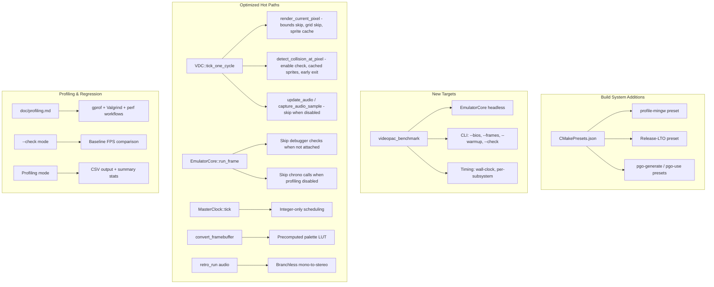
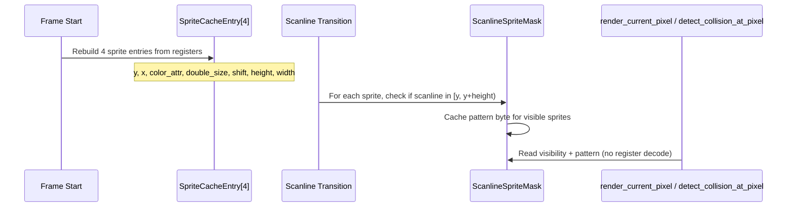

# Design Document: Libretro Core Performance Profiling and Optimization

## Overview

This design covers profiling, benchmarking, and optimizing the videopac libretro core for maximum headless throughput. The emulator is used in the retro-ai reinforcement learning framework where training speed is directly bottlenecked by emulation performance.

The approach is profile-first: establish a benchmark harness, measure with gprof/Valgrind/perf, then apply targeted optimizations to the hot paths identified by profiling data. All optimizations must preserve bit-identical framebuffer output.

The dominant hot path is `VDC::tick_one_cycle()`, called ~59,605 times per NTSC frame. Within it, `render_current_pixel()` and `detect_collision_at_pixel()` perform per-pixel work including grid/character/sprite lookups and collision checks. Secondary hot paths include `MasterClock::tick()` (called ~119,210 times per frame at NTSC divisor 2), CPU instruction dispatch, and the per-frame `convert_framebuffer()` in the libretro core.

### Design Rationale

The optimizations are organized in priority order based on expected impact:

1. **VDC render pipeline** (Req 2) — the innermost per-pixel loop, called 160×240 = 38,400 times per visible frame area
2. **Collision detection** (Req 3) — runs on every visible pixel when display is enabled
3. **Audio path** (Req 4) — called every VDC cycle regardless of whether audio is active
4. **CPU dispatch** (Req 5) — debugger checks on every instruction even when no debugger attached
5. **Master clock** (Req 6) — per-tick overhead from virtual function calls and division
6. **Framebuffer conversion** (Req 7) — per-frame palette lookup and mono-to-stereo copy
7. **Build system** (Req 0, 8) — profiling presets, LTO, PGO for cross-TU optimization

## Architecture

The optimization work fits within the existing architecture without structural changes. The key additions are:



### Optimization Strategy

All optimizations follow these principles:

- **Measure first**: Use the benchmark harness to establish baseline FPS before any code changes
- **Bit-identical output**: Every optimization must produce the same framebuffer as the unoptimized code
- **Incremental**: Each optimization is independent and can be applied/reverted individually
- **Zero-cost when disabled**: Profiling instrumentation adds no overhead when the profiling flag is off

## Components and Interfaces

### 1. Benchmark Harness (`tools/videopac_benchmark.cpp`)

A standalone CLI tool that loads a BIOS + ROM and runs N frames headless, reporting performance metrics.

```cpp
// Command-line interface
// videopac_benchmark --bios <path> <rom_path> [--frames N] [--warmup N]
//                    [--check --baseline-fps F]
//                    [--profile-output <csv_path>]

struct BenchmarkConfig {
    std::string bios_path;
    std::string rom_path;
    int frames = 6000;        // Default: 100 seconds NTSC
    int warmup_frames = 60;   // Default: 1 second warmup
    bool check_mode = false;
    double baseline_fps = 0.0;
    std::string profile_output; // CSV output path (empty = summary to stdout)
};

struct BenchmarkResult {
    double wall_clock_seconds;
    double avg_fps;
    double avg_us_per_frame;
    double cpu_pct;
    double vdc_pct;
    double overhead_pct;
};

// Returns non-zero exit code if --check mode and FPS < baseline * 0.9
int run_benchmark(const BenchmarkConfig& config);
```

CMake target: `videopac_benchmark` linked against `videopac_core` only (no SDL dependency).

### 2. VDC Sprite Cache (`include/vdc.h` additions)

Per-frame cached sprite bounding box data to avoid recomputing attributes on every pixel.

```cpp
// Added to VDCState or as VDC private members
struct SpriteCacheEntry {
    uint8_t y;
    uint8_t x;
    uint8_t color_attr;
    bool double_size;
    bool shift_even;
    bool shift_full;
    int height;       // 16 or 32
    int width;        // 8 or 16
};

// Per-scanline visibility mask: which sprites are visible on this scanline
// Recomputed at each scanline transition in tick_one_cycle()
struct ScanlineSpriteMask {
    bool visible[4];           // true if sprite Y range includes this scanline
    uint8_t pattern[4];        // cached pattern byte for this scanline's sprite row
};
```

### 3. Palette LUT (`src/libretro.cpp` additions)

Precomputed 16-entry XRGB8888 lookup table, built once at init.

```cpp
// Built in retro_load_game() or retro_init()
static uint32_t palette_lut[16];

// Init:
for (int i = 0; i < 16; i++) {
    const auto& c = videopac::PALETTE_STANDARD[i];
    palette_lut[i] = (0xFFu << 24) | (c.r << 16) | (c.g << 8) | c.b;
}

// Usage in convert_framebuffer():
video_buffer[i] = palette_lut[fb[i] & 0x0F];
```

### 4. Profiling Mode Enhancements (`include/emulator.h` / `src/emulator.cpp`)

Enhanced profiling with CSV output and summary statistics.

```cpp
// New Configuration fields
struct Configuration {
    // ... existing fields ...
    std::string profile_output_path;  // Empty = summary to stdout
};

// Per-frame timing record for CSV output
struct FrameTiming {
    uint64_t frame_number;
    uint64_t cpu_us;
    uint64_t vdc_us;
    uint64_t overhead_us;
    uint64_t total_us;
};

// Summary statistics computed at end of run
struct ProfilingSummary {
    double min_frame_us;
    double max_frame_us;
    double mean_frame_us;
    double p95_frame_us;
};
```

### 5. CMake Presets (additions to `CMakePresets.json`)

```json
{
    "name": "profile-mingw",
    "inherits": ["flags-mingw", "ci-std", "cmake-pedantic"],
    "binaryDir": "${sourceDir}/build/profile-mingw",
    "cacheVariables": {
        "CMAKE_BUILD_TYPE": "RelWithDebInfo",
        "CMAKE_CXX_FLAGS": "-pg -O2 -g -Wall -Wextra -Wpedantic",
        "CMAKE_EXE_LINKER_FLAGS": "-pg"
    }
}
```

Plus `Release-LTO`, `pgo-generate`, and `pgo-use` presets.

## Data Models

### Benchmark Output Format (stdout)

```
Videopac Benchmark
==================
ROM: satellite_attack.bin
Frames: 6000 (warmup: 60)
---------------------------
Wall clock:    12.345 s
Average FPS:   486.0
Avg frame:     2057 us
---------------------------
CPU:           23.4%
VDC:           71.2%
Overhead:       5.4%
```

### CSV Profiling Output Format

```csv
frame_number,cpu_us,vdc_us,overhead_us,total_us
1,450,1200,150,1800
2,460,1180,140,1780
...
```

### Summary Statistics Output (when no CSV path specified)

```
Profiling Summary (6000 frames)
================================
Min frame:     1650 us
Max frame:     2400 us
Mean frame:    1820 us
P95 frame:     2100 us
```

### Benchmark --check Mode Output

```
PASS: 486.0 FPS >= 437.4 FPS (baseline 486.0, threshold 90%)
```
or
```
FAIL: 380.0 FPS < 437.4 FPS (baseline 486.0, threshold 90%)
Exit code: 1
```

### Sprite Cache Data Flow




## Correctness Properties

*A property is a characteristic or behavior that should hold true across all valid executions of a system — essentially, a formal statement about what the system should do. Properties serve as the bridge between human-readable specifications and machine-verifiable correctness guarantees.*

### Property 1: Bit-identical framebuffer after optimization

*For any* valid VDC register state, ROM data, and sequence of N frames, the optimized `tick_one_cycle()` / `render_current_pixel()` / `detect_collision_at_pixel()` code path shall produce a byte-identical framebuffer compared to the pre-optimization implementation. This covers all render pipeline optimizations (bounds skipping, grid skip, sprite cache, scanline sprite skip), collision detection optimizations (cached sprites, early exit), audio buffer-full skip, debugger-detached skip, and profiling-disabled skip.

**Validates: Requirements 2.1, 2.2, 2.3, 2.4, 2.5, 3.2, 3.3, 4.2, 5.2, 5.3, 9.4**

### Property 2: Zero collision state when collision enable register is zero

*For any* VDC state where the collision enable register (`registers[0xA2]`) is zero, and for any sequence of `tick_one_cycle()` calls within a frame, the `collision_state` field shall remain zero regardless of object positions or overlaps.

**Validates: Requirements 3.1**

### Property 3: Silent audio buffer when audio is disabled

*For any* VDC state where `audio_enabled` is false, after running any number of VDC cycles, all samples in the audio sample buffer shall be zero (silence).

**Validates: Requirements 4.1**

### Property 4: Palette LUT equivalence

*For any* palette index in the range [0, 15], the precomputed `palette_lut[index]` value shall equal `(0xFF << 24) | (PALETTE_STANDARD[index].r << 16) | (PALETTE_STANDARD[index].g << 8) | PALETTE_STANDARD[index].b`. That is, the LUT-based conversion produces identical XRGB8888 output to the per-pixel computation.

**Validates: Requirements 7.1**

### Property 5: Mono-to-stereo sample duplication

*For any* mono audio buffer of length N, the stereo conversion shall produce a buffer of length 2N where for each sample index i, `stereo[2*i] == mono[i]` and `stereo[2*i + 1] == mono[i]`.

**Validates: Requirements 7.2**

### Property 6: Benchmark check mode threshold

*For any* measured FPS value and baseline FPS value (both positive), the `--check` mode shall return exit code 0 (pass) if and only if `measured_fps >= baseline_fps * 0.9`. It shall return non-zero exit code and print a warning if `measured_fps < baseline_fps * 0.9`.

**Validates: Requirements 9.1, 9.2**

### Property 7: Profiling summary statistics correctness

*For any* non-empty list of frame timing values (in microseconds), the profiling summary shall compute: `min` = minimum value, `max` = maximum value, `mean` = arithmetic mean, and `p95` = 95th percentile (value at index `ceil(0.95 * N) - 1` when sorted ascending).

**Validates: Requirements 10.2**

## Error Handling

### Benchmark Harness Errors

| Error Condition | Handling |
|---|---|
| BIOS file not found / unreadable | Print error to stderr, exit code 2 |
| ROM file not found / unreadable | Print error to stderr, exit code 2 |
| Invalid `--frames` or `--warmup` value (≤ 0) | Print usage, exit code 2 |
| `--check` without `--baseline-fps` | Print usage, exit code 2 |
| `--baseline-fps` ≤ 0 | Print error, exit code 2 |
| `--profile-output` path not writable | Print error to stderr, exit code 2 |
| Emulator fails to initialize | Print error, exit code 3 |

### Optimization Error Handling

All optimizations are correctness-preserving fast paths. They use early-return or skip patterns, never introducing new error conditions. The existing error handling in VDC register access, ROM address validation, and framebuffer bounds checking remains unchanged.

### Profiling Mode Errors

| Error Condition | Handling |
|---|---|
| CSV output file not writable | Fall back to summary-to-stdout mode, log warning |
| Zero frames profiled | Skip summary output (no division by zero) |

## Testing Strategy

### Dual Testing Approach

Testing uses both unit tests (specific examples, edge cases) and property-based tests (universal properties across generated inputs). The project already uses Google Test and RapidCheck.

### Property-Based Tests

Each correctness property maps to a single property-based test with minimum 100 iterations. RapidCheck is already integrated via CMake FetchContent.

| Property | Test Description | Generator Strategy |
|---|---|---|
| Property 1: Bit-identical framebuffer | Generate random VDC register states, run N cycles through both optimized and reference paths, compare framebuffers byte-by-byte | Random register values for sprites (Y, X, color, pattern), characters, grid, control register. Run 1-10 scanlines. |
| Property 2: Zero collision when disabled | Generate random VDC states with collision_enable=0 and overlapping objects, run cycles, verify collision_state==0 | Random sprite/character positions that would normally collide, but collision register forced to 0. |
| Property 3: Silent audio when disabled | Generate random VDC states with audio_enabled=false, run cycles, verify all audio samples are 0 | Random audio register values, but sound control enable bit forced to 0. |
| Property 4: Palette LUT equivalence | Generate random palette indices 0-15, verify LUT[i] == computed value | Uniform random in [0, 15]. |
| Property 5: Mono-to-stereo duplication | Generate random mono buffers, convert, verify stereo[2i]==stereo[2i+1]==mono[i] | Random int16 arrays of length 1-2048. |
| Property 6: Benchmark check threshold | Generate random (measured_fps, baseline_fps) pairs, verify pass/fail matches threshold formula | Random positive doubles. |
| Property 7: Summary statistics | Generate random frame timing lists, verify min/max/mean/p95 against reference computation | Random uint64 arrays of length 1-10000. |

### Unit Tests

| Test | Description |
|---|---|
| Benchmark CLI parsing | Verify default values (6000 frames, 60 warmup), flag parsing |
| Benchmark output format | Verify stdout contains required fields (FPS, wall clock, subsystem %) |
| Sprite cache rebuild | Verify cache entries match register values after write_register |
| Scanline sprite mask | Verify visibility mask for sprites at known Y positions |
| Grid skip when disabled | Verify render_current_pixel skips grid when control bit is off |
| Collision early exit | Verify collision detection finds same results with early exit |
| Palette LUT init | Verify all 16 entries match expected XRGB8888 values |
| CSV output format | Verify CSV header and row format |
| Summary stats edge cases | Empty list, single element, all same values |
| Profile-mingw preset | Verify preset exists in CMakePresets.json with -pg flags |

### Test Configuration

- Property-based tests: minimum 100 iterations per property (RapidCheck default)
- Each property test tagged with: `Feature: libretro-performance, Property N: <title>`
- Tests added to existing `videopac_tests` target
- Benchmark integration tests require BIOS + ROM files (skipped if not available)
