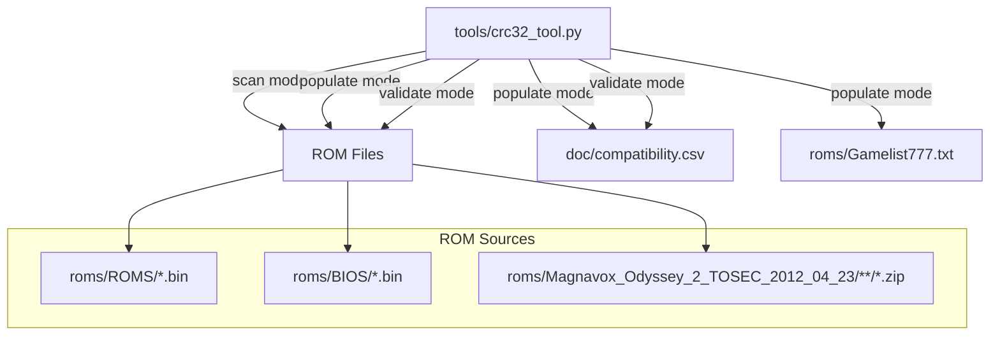
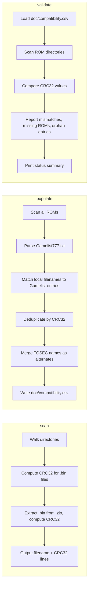

# Design Document: ROM Compatibility Database

## Overview

This feature adds a CSV-based ROM compatibility database (`doc/compatibility.csv`) and a companion Python CLI tool (`tools/crc32_tool.py`) that automates checksum computation, database population, and validation. The database catalogs all known Odyssey 2 / Videopac ROMs with CRC32 checksums, game names, platform info, and emulator compatibility status.

The tool operates in three modes:
- **scan**: Compute CRC32 checksums from ROM files (loose .bin and TOSEC zip archives)
- **populate**: Generate the full CSV database by scanning ROMs, parsing the Gamelist, and merging/deduplicating by CRC32
- **validate**: Check database consistency against the actual ROM collection

### Key Design Decisions

1. **CSV over JSON/SQLite**: CSV is human-readable, diff-friendly in git, and trivially editable. The dataset is small (~220 entries) so query performance is irrelevant.
2. **Python for the tool**: The project already uses Python scripts (`scripts/annotate_trace.py`, `scripts/compare_traces.py`). Python's `zipfile` and `zlib` modules handle CRC32 and zip extraction natively — no external dependencies needed.
3. **CRC32 as canonical identifier**: Same binary content produces the same CRC regardless of filename. This is the natural deduplication key across the Local_ROM_Set and TOSEC_Set.

## Architecture

The system has two components with no coupling to the emulator C++ codebase:



### Mode Flow



## Components and Interfaces

### 1. `tools/crc32_tool.py` — CLI Entry Point

```
usage: crc32_tool.py [-h] {scan,populate,validate} ...

ROM Compatibility Database Tool

subcommands:
  scan       Compute CRC32 checksums for ROM files
  populate   Generate compatibility.csv from ROM collection
  validate   Validate database against ROM files

scan options:
  path       Path to file, directory, or zip archive

populate options:
  --roms-dir      Path to local ROM directory (default: roms/ROMS)
  --bios-dir      Path to BIOS directory (default: roms/BIOS)
  --tosec-dir     Path to TOSEC directory (default: roms/Magnavox_Odyssey_2_TOSEC_2012_04_23)
  --gamelist      Path to Gamelist777.txt (default: roms/Gamelist777.txt)
  --output        Output CSV path (default: doc/compatibility.csv)

validate options:
  --database      Path to compatibility.csv (default: doc/compatibility.csv)
  --roms-dir      Path to local ROM directory (default: roms/ROMS)
  --bios-dir      Path to BIOS directory (default: roms/BIOS)
  --tosec-dir     Path to TOSEC directory (default: roms/Magnavox_Odyssey_2_TOSEC_2012_04_23)
```

### 2. CRC32 Computation Module

Functions for computing CRC32 from files and zip archives:

```python
def compute_crc32(filepath: str) -> str:
    """Compute CRC32 of a file, return 8-char uppercase hex string."""

def compute_crc32_from_bytes(data: bytes) -> str:
    """Compute CRC32 of raw bytes, return 8-char uppercase hex string."""

def scan_directory(dirpath: str) -> list[RomInfo]:
    """Recursively scan directory for .bin files, compute CRC32 for each."""

def scan_zip(zippath: str) -> list[RomInfo]:
    """Extract .bin files from zip archive, compute CRC32 for each."""

def scan_all(roms_dir: str, bios_dir: str, tosec_dir: str) -> list[RomInfo]:
    """Scan all ROM sources, return list of RomInfo with source tracking."""
```

### 3. Gamelist Parser

```python
def parse_gamelist(filepath: str) -> dict[str, str]:
    """Parse Gamelist777.txt, return dict mapping filename stem -> game name.
    
    Handles the format:
        vp_01.bin        Race/Spin-out/Cryptogram
        vp_01hack.bin    Race/Spin-out/Cryptogram  (color hack)
    
    Returns: {"vp_01": "Race/Spin-out/Cryptogram", ...}
    """
```

### 4. Database Population Module

```python
def deduplicate_by_crc(roms: list[RomInfo]) -> dict[str, MergedEntry]:
    """Group ROMs by CRC32, merge filenames, pick primary name."""

def merge_with_gamelist(entries: dict[str, MergedEntry], gamelist: dict[str, str]) -> list[CsvRow]:
    """Assign game names from Gamelist, TOSEC names as alternates."""

def write_csv(rows: list[CsvRow], output_path: str) -> None:
    """Write sorted CSV to disk."""
```

### 5. Database Validation Module

```python
def load_csv(filepath: str) -> list[CsvRow]:
    """Load and parse compatibility.csv."""

def validate(database: list[CsvRow], scanned: list[RomInfo]) -> ValidationReport:
    """Compare database against scanned ROMs, return report."""
```

## Data Models

### RomInfo (intermediate scan result)

```python
@dataclass
class RomInfo:
    filename: str       # e.g. "vp_01.bin" or "Race - Spin-out... .bin"
    crc32: str          # 8-char uppercase hex, e.g. "A1B2C3D4"
    size: int           # file size in bytes
    source: str         # "local", "bios", or "tosec"
    zip_path: str | None  # path to containing zip, if from TOSEC
```

### CsvRow (database entry)

```python
@dataclass
class CsvRow:
    crc32: str          # 8-char uppercase hex, or empty string
    name: str           # human-readable game title
    filename: str       # primary filename (Gamelist convention)
    size: int           # ROM file size in bytes
    platform: str       # O2, VP, VP+, Jopac, Brazilian
    region: str         # US, EU, FR, BR, CA, EU-US, etc.
    status: str         # one of the 7 Compatibility_Status values
    alt_filenames: str  # semicolon-separated alternate filenames
    notes: str          # free-text notes
```

### ValidationReport

```python
@dataclass
class ValidationReport:
    crc_mismatches: list[tuple[str, str, str]]  # (filename, expected_crc, actual_crc)
    missing_roms: list[str]                      # DB entries with no ROM file found
    orphan_roms: list[tuple[str, str]]           # (filename, crc) found on disk but not in DB
    status_counts: dict[str, int]                # status -> count
```

### CSV Format

File: `doc/compatibility.csv`

```csv
crc32,name,filename,size,platform,region,status,alt_filenames,notes
A1B2C3D4,Race/Spin-out/Cryptogram,vp_01.bin,2048,VP,EU,not_tested,Speedway + Spin-out + Crypto-logic (1978)(Philips)(EU-US).bin,
```

Column rules:
- `crc32`: 8-char uppercase hex or empty
- `name`: human-readable title from Gamelist, or TOSEC filename stem if no Gamelist match
- `filename`: primary filename (Gamelist convention preferred)
- `size`: integer bytes
- `platform`: derived from filename prefix (`vp_` → VP, `o2_` → O2, `jo_` → Jopac, `br_` → Brazilian, `_pl` suffix → VP+)
- `region`: derived from TOSEC naming `(EU)`, `(US)`, `(FR)`, `(BR)`, etc. or from filename prefix
- `status`: defaults to `not_tested`
- `alt_filenames`: semicolon-separated list of alternate filenames (TOSEC names when local name is primary)
- `notes`: free text, may contain commas (CSV quoting handles this)

### Platform Detection Logic

The platform is inferred from the filename prefix in the Gamelist:
- `vp_` → VP (Videopac)
- `vp_*pl*` or `vp_*_pl*` → VP+ (Videopac Plus)
- `o2_` → O2 (Odyssey 2)
- `jo_` → Jopac
- `br_` → Brazilian
- `pb_` → VP (Parker Brothers, released on Videopac)
- `im_` → VP (Imagic, released on Videopac)
- `bios_` → BIOS (not a game, but included for completeness)
- `pr_` → VP (prototype)
- `mod_` → inherits from the base game's platform
- `new_` → VP (homebrew)
- `ntsc_` → O2 (NTSC conversions)
- `pal_` → VP (PAL conversions)
- TOSEC-only ROMs: parse from TOSEC filename region tags

### Region Detection Logic

- TOSEC filenames contain region in parentheses: `(EU)`, `(US)`, `(FR)`, `(BR)`, `(CA)`, `(EU-US)`
- Local filenames: `br_` → BR, `ntsc_` → US, `_F.bin` suffix → FR, otherwise EU (default for VP)

### Gamelist Parsing Rules

The Gamelist777.txt format is:
```
filename.bin         Description text
```
- Lines with `.bin` followed by whitespace and text are entries
- The filename stem (without `.bin`) is the key
- Everything after the whitespace gap is the game name/description
- Lines starting with known prefixes but no `.bin` are section headers or notes (skip)
- Blank lines and comment-style lines are skipped

### Sorting

Entries are sorted by:
1. Platform category (BIOS first, then O2, VP, VP+, Jopac, Brazilian)
2. Alphabetically by `name` within each platform


## Correctness Properties

*A property is a characteristic or behavior that should hold true across all valid executions of a system — essentially, a formal statement about what the system should do. Properties serve as the bridge between human-readable specifications and machine-verifiable correctness guarantees.*

### Property 1: CSV Round-Trip Preservation

*For any* list of valid CsvRow entries, writing them to CSV and reading them back should produce an equivalent list of entries with all fields preserved (crc32, name, filename, size, platform, region, status, alt_filenames, notes) — including entries with commas, quotes, and special characters in the notes field.

**Validates: Requirements 1.1, 1.2, 2.3**

### Property 2: CRC32 Format Invariant

*For any* byte sequence (0 to 16384 bytes, covering the ROM size range), computing its CRC32 should produce a string that is exactly 8 characters long and consists only of uppercase hexadecimal characters (0-9, A-F).

**Validates: Requirements 3.1**

### Property 3: Deduplication Uniqueness

*For any* list of RomInfo entries (potentially containing duplicate CRC32 values), deduplication should produce a result where every CRC32 value appears exactly once, and every unique CRC32 from the input is represented in the output.

**Validates: Requirements 1.4, 4.2**

### Property 4: Sort Invariant

*For any* list of CsvRow entries written by the populate command, entries within each platform group should be sorted alphabetically by name (case-insensitive).

**Validates: Requirements 1.6**

### Property 5: Cross-Source Merge Produces Single Entry with Correct Names

*For any* set of RomInfo entries where the same CRC32 appears in both "local" and "tosec" sources, and the local filename has a Gamelist match, deduplication should produce a single entry where the name comes from the Gamelist and the TOSEC filename appears in alt_filenames.

**Validates: Requirements 1.7, 4.4**

### Property 6: Name Resolution Always Produces a Non-Empty Name

*For any* RomInfo entry, after merge with the Gamelist: if the local filename matches a Gamelist entry, the name should be the Gamelist name; if the ROM is TOSEC-only, the name should be derived from the TOSEC filename; if the ROM is local but has no Gamelist match, the name should be the filename. In all cases, the resulting name is non-empty.

**Validates: Requirements 4.3, 4.5, 4.6**

### Property 7: New Entries Default to Valid Status

*For any* ROM collection processed by the populate command, every entry in the output should have a status value that is one of the 7 valid Compatibility_Status values, and specifically should be `not_tested` for newly generated entries.

**Validates: Requirements 2.1, 2.2**

### Property 8: Scan Completeness

*For any* directory tree containing .bin files (both loose and inside zip archives), scanning should return a RomInfo for every .bin file present — the count of results should equal the total count of .bin files across all directories and zip archives.

**Validates: Requirements 3.2, 3.3, 3.4, 4.1**

### Property 9: Validation Detects All CRC Mismatches

*For any* database and ROM collection where some entries have CRC32 values that differ from the actual file CRC32, the validation report should include every mismatched entry — the set of reported mismatches should equal the set of actual mismatches.

**Validates: Requirements 5.1**

### Property 10: Validation Detects All Missing ROMs

*For any* database containing entries whose filenames do not correspond to any file in the scanned directories, the validation report should list every such orphan entry.

**Validates: Requirements 5.2**

### Property 11: Status Summary Accuracy

*For any* database, the status summary counts should exactly equal the actual count of entries for each Compatibility_Status value.

**Validates: Requirements 5.3**

## Error Handling

### File I/O Errors
- **Unreadable .bin file**: Log a warning with the file path, skip the file, continue scanning. The error should not prevent other files from being processed.
- **Corrupt zip archive**: Log a warning with the zip path, skip the archive, continue scanning.
- **Missing Gamelist777.txt**: In populate mode, exit with an error message. The Gamelist is required for name resolution.
- **Missing compatibility.csv**: In validate mode, exit with an error message. In populate mode, create a new file.
- **CSV parse errors**: If compatibility.csv has malformed rows, log a warning per row and skip them.

### Data Integrity
- **Duplicate CRC32 within same source**: Keep the first occurrence, log a warning about the duplicate.
- **Empty .bin file inside zip**: Compute CRC32 normally (CRC32 of empty data is `00000000`), include in results.
- **Non-.bin files**: Silently skip files that don't end in `.bin` (case-insensitive).
- **Encoding issues in Gamelist**: The Gamelist contains ISO-8859-1 characters (e.g., `René`). Read with `latin-1` encoding, store as UTF-8 in CSV.

### Exit Codes
- `0`: Success
- `1`: Fatal error (missing required file, invalid arguments)
- `2`: Completed with warnings (corrupt files skipped, mismatches found in validate mode)

## Testing Strategy

### Property-Based Testing

The tool is a Python script, so property-based tests use **Hypothesis** (the standard Python PBT library).

Each correctness property maps to a single Hypothesis test. Tests should run a minimum of 100 examples each.

Each test is tagged with a comment referencing the design property:
```python
# Feature: rom-compatibility-database, Property 1: CSV round-trip preservation
```

**Generators needed:**
- `RomInfo` generator: random filenames (.bin suffix), random CRC32 hex strings, random sizes (1–16384), random source ("local", "bios", "tosec")
- `CsvRow` generator: random entries with valid field values, including edge cases (commas in notes, empty CRC32, special characters)
- `Gamelist` generator: random filename→name mappings
- `byte array` generator: random bytes (0–16384 length) for CRC32 computation
- `directory tree` generator: temp directories with .bin files and .zip archives containing .bin files

### Unit Tests

Unit tests complement property tests for specific examples and edge cases:

- **Gamelist parsing**: Test with actual Gamelist777.txt format samples (prefix detection, multi-word names, entries with parenthetical notes)
- **Platform detection**: Test each prefix (`vp_`, `o2_`, `jo_`, `br_`, `pb_`, `im_`, `pr_`, `mod_`, `new_`, `ntsc_`, `pal_`, `bios_`) maps to the correct platform
- **Region detection**: Test TOSEC region parsing `(EU)`, `(US)`, `(FR)`, `(BR)`, `(EU-US)`, and local filename conventions
- **TOSEC filename parsing**: Test extraction of game name, year, publisher, region from TOSEC naming convention
- **Error handling**: Test with corrupt zip files, unreadable files, missing directories
- **Edge cases**: Empty directories, zip with no .bin files, ROM with empty CRC32 field, entries with commas/quotes in notes

### Test Organization

```
tests/
  test_crc32_tool.py          # Unit tests
  test_crc32_tool_props.py    # Property-based tests (Hypothesis)
```

Run with:
```bash
pytest tests/test_crc32_tool.py tests/test_crc32_tool_props.py -v
```
