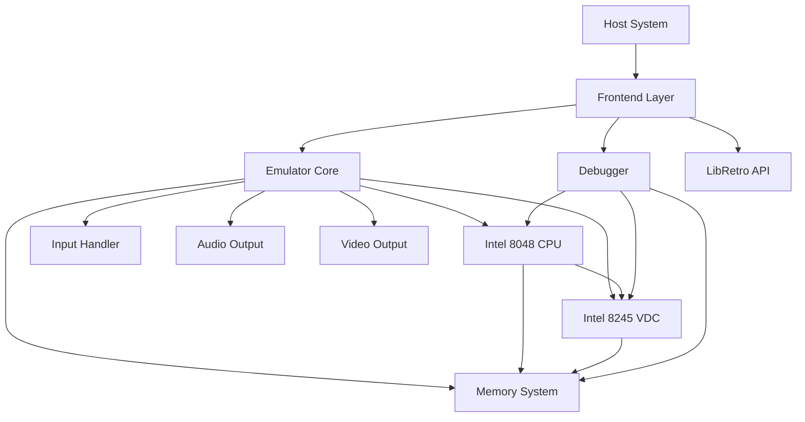

# Design Document: Philips Videopac (Odyssey2) Emulator

## Overview

This design document describes the architecture and implementation approach for a Philips Videopac/Odyssey2 emulator. The emulator will accurately simulate the original hardware including the Intel 8048 CPU, Intel 8245 VDC, memory systems, and I/O devices.

The design follows a modular architecture where each hardware component is implemented as an independent module with well-defined interfaces. The emulator core orchestrates these components, managing timing, synchronization, and data flow between modules.

### Key Design Principles

1. **Accuracy over speed**: Prioritize cycle-accurate emulation to ensure compatibility
2. **Modularity**: Each hardware component is independently testable
3. **Separation of concerns**: Core emulation logic is separate from platform-specific I/O
4. **Testability**: All components support property-based testing for correctness

## Architecture

### High-Level Architecture



### Component Responsibilities

**Emulator Core**
- Orchestrates all hardware components
- Manages timing and synchronization
- Coordinates frame rendering and audio generation
- Handles reset and initialization

**CPU Module**
- Executes Intel 8048 instructions
- Manages internal RAM and registers
- Handles interrupts and stack operations
- Provides I/O port access

**VDC Module**
- Generates video output (160x200 resolution)
- Renders sprites, characters, and grid
- Detects collisions between graphics objects
- Generates audio waveforms
- Manages memory-mapped registers

**Memory System**
- Loads and manages BIOS ROM
- Loads and manages cartridge ROM
- Implements bank switching for large cartridges
- Provides external RAM access
- Routes memory requests to appropriate components

**Input Handler**
- Emulates keyboard matrix
- Handles joystick input
- Maps host system input to Videopac controls

**Frontend Layer**
- Provides platform-specific display output
- Handles audio output
- Manages user interface and configuration
- Implements save state functionality

## Components and Interfaces

### CPU Component

The CPU component emulates the Intel 8048 microcontroller with cycle-accurate instruction execution.

#### CPU State Structure

```
CPUState:
  - pc: uint16              // Program counter (12-bit, 0x000-0xFFF)
  - a: uint8                // Accumulator
  - psw: uint8              // Program Status Word
  - r[16]: uint8            // Registers R0-R7 and R0'-R7'
  - ram[64]: uint8          // Internal RAM
  - stack[8]: uint16        // 8-level stack
  - sp: uint8               // Stack pointer (0-7)
  - port1: uint8            // Port 1 state
  - port2: uint8            // Port 2 state
  - timer: uint8            // Timer/counter register
  - timer_running: bool     // Timer enabled flag
  - interrupts_enabled: bool
  - timer_interrupts_enabled: bool
  - clock_cycles: uint64    // Total cycles executed
  - current_bank: uint8     // Current register bank (0 or 1)
```

#### CPU Interface

```
CPU:
  reset() -> void
    // Reset CPU to initial state, PC = 0x000
  
  execute_instruction() -> uint8
    // Execute one instruction, return cycle count
  
  read_memory(address: uint16) -> uint8
    // Read from program memory (ROM)
  
  write_memory(address: uint16, value: uint8) -> void
    // Write to external memory (RAM or VDC)
  
  read_port(port: uint8) -> uint8
    // Read from I/O port (1 or 2)
  
  write_port(port: uint8, value: uint8) -> void
    // Write to I/O port
  
  trigger_interrupt(vector: uint16) -> void
    // Trigger interrupt at specified vector
  
  get_state() -> CPUState
    // Get complete CPU state for debugging/save states
  
  set_state(state: CPUState) -> void
    // Restore CPU state from save state
```

#### Instruction Execution

The CPU implements all 96 Intel 8048 instructions organized by category:

- **Data Transfer**: MOV, MOVX, MOVP, XCH, XCHD
- **Arithmetic**: ADD, ADDC, INC, DEC, DA
- **Logical**: ANL, ORL, XRL, CLR, CPL
- **Branch**: JMP, DJNZ, JC, JNC, JZ, JNZ, JT0, JNT0, JT1, JNT1, JF0, JF1, JTF, JNIBF, JOBF
- **Subroutine**: CALL, RET, RETR
- **I/O**: IN, OUT, INS, OUTL, ANL, ORL
- **Control**: NOP, EN I, DIS I, EN TCNTI, DIS TCNTI, STRT CNT, STRT T, STOP TCNT, SEL RB0, SEL RB1

Each instruction updates the appropriate registers, flags, and memory based on the Intel 8048 specification.

### VDC Component

The VDC component emulates the Intel 8245 Video Display Controller.

#### VDC State Structure

```
VDCState:
  - registers[256]: uint8   // Memory-mapped registers 0x00-0xFF
  - scanline: uint16        // Current scanline (0-311 PAL, 0-261 NTSC)
  - beam_x: uint8           // Horizontal beam position
  - beam_y: uint8           // Vertical beam position
  - framebuffer[160][200]: uint8  // Output frame buffer (palette indices)
  - collision_state: uint8  // Current collision detection state
  - video_standard: VideoStandard  // PAL or NTSC
  - enabled: bool           // VDC enabled flag
```

#### VDC Interface

```
VDC:
  reset() -> void
    // Reset VDC to initial state
  
  write_register(address: uint8, value: uint8) -> void
    // Write to VDC register
  
  read_register(address: uint8) -> uint8
    // Read from VDC register
  
  tick(cycles: uint8) -> void
    // Advance VDC by specified number of cycles
  
  render_scanline() -> void
    // Render current scanline to framebuffer
  
  get_framebuffer() -> [uint8; 160*200]
    // Get current framebuffer for display
  
  is_vblank() -> bool
    // Check if in vertical blank period
  
  is_hblank() -> bool
    // Check if in horizontal blank period
  
  get_audio_sample() -> int16
    // Get current audio sample from shift register
  
  get_state() -> VDCState
    // Get complete VDC state
  
  set_state(state: VDCState) -> void
    // Restore VDC state
```

#### Graphics Rendering Pipeline

The VDC renders graphics in priority order:

1. **Background**: Solid color from color register
2. **Grid**: Horizontal and vertical lines, optional dots
3. **Characters**: Single characters and quad groups
4. **Sprites**: Four 8x8 or 16x16 sprites

Each scanline rendering:
1. Clear scanline buffer to background color
2. Render grid elements if enabled
3. Render characters if enabled
4. Render sprites if enabled
5. Detect collisions during rendering
6. Copy scanline to framebuffer

#### Collision Detection

Collision detection tracks overlaps between:
- Sprites 0-3 (individual bits)
- Vertical grid lines
- Horizontal grid lines
- Dot grid
- Character objects

Collisions are detected pixel-by-pixel during rendering and stored in the collision register (0xA2). The status register (0xA1) bit 7 indicates character-to-character collisions.

#### Audio Generation

The VDC generates audio using a 24-bit shift register:
- Registers 0xA7-0xA9 hold the 24-bit pattern
- Shift frequency: 983Hz or 3933Hz (bit 5 of 0xAA)
- Noise mode: XOR feedback (bit 4 of 0xAA)
- Loop mode: Continuous or one-shot (bit 6 of 0xAA)
- Volume: 4-bit value (bits 0-3 of 0xAA)
- Enable: Bit 7 of 0xAA

Audio samples are generated by shifting the register and outputting the current bit, scaled by volume.

### Memory System

The memory system manages all memory access and routing.

#### Memory Map

```
0x000-0x3FF: CPU internal ROM (BIOS, 1KB)
0x400-0xFFF: Cartridge ROM (2KB-8KB with banking)
0x00-0x3F:   CPU internal RAM (64 bytes)
0x00-0x7F:   External RAM (128 bytes)
0x00-0xFF:   VDC registers (256 bytes)
```

#### Memory Interface

```
MemorySystem:
  load_bios(data: [uint8]) -> Result
    // Load BIOS ROM into internal memory
  
  load_cartridge(data: [uint8]) -> Result
    // Load cartridge ROM, detect size and banking
  
  read_program(address: uint16) -> uint8
    // Read from program memory (ROM)
  
  read_external(address: uint8) -> uint8
    // Read from external RAM or VDC
  
  write_external(address: uint8, value: uint8) -> void
    // Write to external RAM or VDC
  
  set_bank(bank: uint8) -> void
    // Set current ROM bank for bank-switched cartridges
  
  get_state() -> MemoryState
    // Get memory state for save states
  
  set_state(state: MemoryState) -> void
    // Restore memory state
```

#### Bank Switching

Cartridges larger than 2KB use bank switching:
- 4KB cartridges: 2 banks, selected by Port 1 pin P10
- 8KB cartridges: 4 banks, selected by Port 1 pins P10-P11

Bank selection:
- P10=0, P11=0: Bank 0
- P10=1, P11=0: Bank 1
- P10=0, P11=1: Bank 2
- P10=1, P11=1: Bank 3

The memory system monitors Port 1 writes and switches banks accordingly.

#### Memory Access Control

Port 1 controls memory access:
- P13=0: VDC enabled for read/write
- P14=0: External RAM enabled for read/write
- P16=1, P13=0, P14=0: Copy mode (RAM to VDC transfer)

The memory system routes read/write operations based on these control signals.

### Input Handler

The input handler emulates the keyboard matrix and joystick controllers.

#### Keyboard Matrix

The Videopac keyboard is an 8x8 matrix:
- Rows selected via Port 1 (P10-P17)
- Columns read via Port 2 (P20-P27) when P12=0

Matrix layout:
```
     Col0  Col1  Col2  Col3  Col4  Col5  Col6  Col7
Row0:  0     1     2     3     4     5     6     7
Row1:  8     9     -     +     *     /     =     %
Row2:  A     B     C     D     E     F     G     H
Row3:  I     J     K     L     M     N     O     P
Row4:  Q     R     S     T     U     V     W     X
Row5:  Y     Z     .     ,     ;     :     ?     !
Row6: SPC   ENT   CLR   YES   NO   (special keys)
Row7: (function keys)
```

#### Joystick Input

Two joysticks, each with 5 bits:
- Bit 0: Up
- Bit 1: Right
- Bit 2: Down
- Bit 3: Left
- Bit 4: Fire button

Joystick selection via Port 2 (P20-P22):
- 0b000: Joystick 2 enabled
- 0b111: Joystick 1 enabled

#### Input Interface

```
InputHandler:
  set_key_state(row: uint8, col: uint8, pressed: bool) -> void
    // Set keyboard key state
  
  set_joystick_state(joystick: uint8, direction: Direction, pressed: bool) -> void
    // Set joystick direction state
  
  set_joystick_button(joystick: uint8, pressed: bool) -> void
    // Set joystick fire button state
  
  read_keyboard(row_select: uint8) -> uint8
    // Read keyboard columns for selected row
  
  read_joystick(select: uint8) -> uint8
    // Read joystick state based on selection bits
  
  map_host_key(host_key: KeyCode) -> (uint8, uint8)
    // Map host system key to Videopac row/col
```

### Emulator Core

The emulator core orchestrates all components and manages timing.

#### Core State

```
EmulatorCore:
  - cpu: CPU
  - vdc: VDC
  - memory: MemorySystem
  - input: InputHandler
  - config: Configuration
  - running: bool
  - paused: bool
  - frame_count: uint64
  - cycles_per_frame: uint32
  - cycles_per_scanline: uint32
```

#### Core Interface

```
EmulatorCore:
  new(config: Configuration) -> EmulatorCore
    // Create new emulator instance
  
  load_bios(path: string) -> Result
    // Load BIOS ROM file
  
  load_rom(path: string) -> Result
    // Load cartridge ROM file
  
  reset() -> void
    // Reset all components to initial state
  
  run_frame() -> void
    // Execute one complete frame
  
  step() -> void
    // Execute one CPU instruction (for debugging)
  
  get_framebuffer() -> [uint8; 160*200]
    // Get current video framebuffer
  
  get_audio_buffer() -> [int16]
    // Get audio samples for current frame
  
  save_state(path: string) -> Result
    // Save complete emulator state
  
  load_state(path: string) -> Result
    // Load emulator state
  
  set_input(input_state: InputState) -> void
    // Update input state from host system
```

#### Timing and Synchronization

The emulator uses cycle-accurate timing:

**NTSC (60Hz)**:
- CPU clock: 5.37 MHz
- Instruction cycle: 5.37 MHz / 15 = 358 kHz
- Frame rate: 60 Hz
- Scanlines per frame: 262
- Cycles per frame: 358000 / 60 ≈ 5967 cycles
- Cycles per scanline: 5967 / 262 ≈ 23 cycles

**PAL (50Hz)**:
- CPU clock: 5.91 MHz
- Instruction cycle: 5.91 MHz / 15 = 394 kHz
- Frame rate: 50 Hz
- Scanlines per frame: 312
- Cycles per frame: 394000 / 50 ≈ 7880 cycles
- Cycles per scanline: 7880 / 312 ≈ 25 cycles

Frame execution loop:
```
for each frame:
  for each scanline:
    execute CPU instructions for cycles_per_scanline
    render scanline if not in VBLANK
    check for HBLANK interrupt
  check for VBLANK interrupt
  update collision detection
  generate audio samples
  synchronize with real-time clock
```

### Disassembler Component

The disassembler converts Intel 8048 machine code to assembly language.

#### Disassembler Interface

```
Disassembler:
  disassemble_instruction(address: uint16, opcode: uint8, operand: uint8) -> Instruction
    // Disassemble single instruction
  
  disassemble_range(memory: [uint8], start: uint16, end: uint16) -> [Instruction]
    // Disassemble address range
  
  disassemble_rom(rom: [uint8]) -> [Instruction]
    // Disassemble entire ROM
  
  format_instruction(instr: Instruction) -> string
    // Format instruction as assembly text
  
  identify_bios_call(address: uint16) -> Option<string>
    // Identify known BIOS routine calls
```

#### Instruction Representation

```
Instruction:
  - address: uint16         // Instruction address
  - opcode: uint8           // Opcode byte
  - operand: Option<uint8>  // Optional operand byte
  - mnemonic: string        // Instruction mnemonic
  - operand_text: string    // Formatted operand
  - cycles: uint8           // Cycle count
  - size: uint8             // Instruction size in bytes
```

The disassembler handles:
- All 96 Intel 8048 instructions
- Immediate values, register operands, memory addresses
- Branch target calculation
- BIOS routine identification
- Formatting for readability

### Frontend Layer

The frontend layer provides platform-specific implementations for display, audio, and user interface.

#### Frontend Interface

```
Frontend:
  initialize() -> Result
    // Initialize display, audio, and input systems
  
  render_frame(framebuffer: [uint8; 160*200], palette: [Color; 8]) -> void
    // Render frame to display
  
  output_audio(samples: [int16]) -> void
    // Output audio samples
  
  poll_input() -> InputState
    // Poll host system input devices
  
  handle_events() -> bool
    // Handle window events, return false to quit
  
  show_menu() -> MenuAction
    // Display menu and return user action
  
  load_rom_dialog() -> Option<string>
    // Show file dialog for ROM loading
  
  show_error(message: string) -> void
    // Display error message
```

#### Configuration

```
Configuration:
  - video_standard: VideoStandard  // PAL or NTSC
  - display_scale: uint8           // Window scale factor
  - audio_sample_rate: uint32      // Audio sample rate (44100, 48000)
  - audio_volume: float            // Master volume (0.0-1.0)
  - key_mappings: Map<KeyCode, (uint8, uint8)>  // Host key to Videopac key
  - joystick_mappings: Map<KeyCode, JoystickInput>  // Host key to joystick
  - bios_path: string              // Path to BIOS ROM
  - save_state_dir: string         // Directory for save states
```

### LibRetro Integration

The LibRetro integration provides a standardized API for RetroArch.

#### LibRetro Core Interface

```
retro_init() -> void
  // Initialize core

retro_deinit() -> void
  // Cleanup core

retro_api_version() -> uint
  // Return API version

retro_get_system_info(info: *SystemInfo) -> void
  // Provide core information

retro_set_environment(callback: EnvironmentCallback) -> void
  // Set environment callback

retro_set_video_refresh(callback: VideoCallback) -> void
  // Set video callback

retro_set_audio_sample(callback: AudioCallback) -> void
  // Set audio callback

retro_set_input_poll(callback: InputPollCallback) -> void
  // Set input poll callback

retro_load_game(info: *GameInfo) -> bool
  // Load ROM

retro_run() -> void
  // Run one frame

retro_serialize_size() -> size_t
  // Get save state size

retro_serialize(data: *uint8, size: size_t) -> bool
  // Serialize state

retro_unserialize(data: *uint8, size: size_t) -> bool
  // Deserialize state
```

The LibRetro core wraps the emulator core and translates between the libretro API and the emulator's internal interfaces.

## Data Models

### Color Palette

The Videopac uses an 8-color palette with two luminance levels:

```
Color:
  - index: uint8  // 0-7
  - r: uint8      // Red component (0-255)
  - g: uint8      // Green component (0-255)
  - b: uint8      // Blue component (0-255)

Palette (bright luminance):
  0: Black   (0x00, 0x00, 0x00)
  1: Blue    (0x00, 0x00, 0xFF)
  2: Green   (0x00, 0xFF, 0x00)
  3: Cyan    (0x00, 0xFF, 0xFF)
  4: Red     (0xFF, 0x00, 0x00)
  5: Magenta (0xFF, 0x00, 0xFF)
  6: Yellow  (0xFF, 0xFF, 0x00)
  7: White   (0xFF, 0xFF, 0xFF)

Dim luminance: Multiply RGB values by 0.5
```

### Sprite Data

```
Sprite:
  - x: uint8           // X position (0-159)
  - y: uint8           // Y position (0-199)
  - color: uint8       // Color index (0-7)
  - pattern: [uint8; 8]  // 8x8 pixel pattern
  - double_size: bool  // 16x16 mode
  - enabled: bool      // Sprite enabled
```

### Character Data

```
Character:
  - x: uint8           // X position
  - y: uint8           // Y position
  - color: uint8       // Color index
  - char_code: uint8   // Character code (0-63)
  - enabled: bool      // Character enabled
```

### Grid Data

```
Grid:
  - rows: [bool; 8]    // Horizontal line enable
  - cols: [bool; 9]    // Vertical line enable
  - color: uint8       // Grid color
  - dot_mode: bool     // Dot grid mode
  - fill_mode: bool    // Fill mode
  - enabled: bool      // Grid enabled
```

### Save State Format

```
SaveState:
  - version: uint32           // Save state format version
  - cpu_state: CPUState       // Complete CPU state
  - vdc_state: VDCState       // Complete VDC state
  - memory_state: MemoryState // Complete memory state
  - input_state: InputState   // Current input state
  - frame_count: uint64       // Frame counter
  - checksum: uint32          // Data integrity checksum
```

Save states are serialized to binary format with version checking and checksum validation.


## Correctness Properties

*A property is a characteristic or behavior that should hold true across all valid executions of a system—essentially, a formal statement about what the system should do. Properties serve as the bridge between human-readable specifications and machine-verifiable correctness guarantees.*

### Property Reflection

After analyzing all acceptance criteria, several redundancies were identified:

- Requirements 1.2 is subsumed by 1.1 (instruction execution inherently tests state updates)
- Requirements 6.4 and 6.5 are covered by 6.3 (frequency selection)
- Requirements 11.3 is covered by 2.3 (bank switching)
- Requirements 12.4 and 12.5 are covered by 8.2 and 8.3 (frame timing)
- Requirements 13.2, 13.3, 13.4, 13.5, 13.7 are covered by requirements 6.1-6.10 (audio generation)
- Many UI and debugging features (Requirements 15, 18) are not testable as properties

The following properties focus on core emulation correctness, eliminating redundant tests while ensuring comprehensive coverage.

### CPU Properties

**Property 1: Instruction execution correctness**
*For any* valid Intel 8048 instruction and initial CPU state, executing the instruction should update the program counter, accumulator, registers, and flags according to the Intel 8048 specification.
**Validates: Requirements 1.1, 1.2**

**Property 2: Internal RAM persistence**
*For any* address in the range 0x00-0x3F and any byte value, writing to internal RAM then reading from the same address should return the same value.
**Validates: Requirements 1.3**

**Property 3: Register bank switching**
*For any* register index (0-7) and any byte value, writing to a register in one bank, switching banks, then switching back should preserve the original value.
**Validates: Requirements 1.4**

**Property 4: Flag operations**
*For any* arithmetic or logical operation that affects flags, the carry flag, auxiliary carry flag, and user flags (F0/F1) should be set according to the operation result.
**Validates: Requirements 1.5**

**Property 5: I/O port access**
*For any* port (1 or 2) and any byte value, writing to a port then reading from the same port should return the written value (subject to port direction configuration).
**Validates: Requirements 1.6**

**Property 6: Instruction cycle counts**
*For any* Intel 8048 instruction, executing it should consume the correct number of cycles (1 or 2) as specified in the instruction set documentation.
**Validates: Requirements 1.9**

**Property 7: Stack operations**
*For any* sequence of up to 8 CALL instructions followed by the same number of RET instructions, the program counter should return to its original value.
**Validates: Requirements 1.10**

**Property 8: Interrupt stack preservation**
*For any* CPU state, when an interrupt occurs, the program counter and PSW should be pushed onto the stack, and executing RETR should restore them exactly.
**Validates: Requirements 9.7, 9.8**

### Memory System Properties

**Property 9: External RAM persistence**
*For any* address in the range 0x00-0x7F and any byte value, when P14 is enabled, writing to external RAM then reading from the same address should return the same value.
**Validates: Requirements 2.4, 2.5**

**Property 10: VDC register access**
*For any* VDC register address (0x00-0xFF) and any byte value, when P13 is enabled, writing to the VDC then reading from the same address should return the written value (for writable registers).
**Validates: Requirements 2.6, 3.6**

**Property 11: Bank switching correctness**
*For any* 4KB or 8KB cartridge, writing different bank selection values to Port 1 (P10-P11) should make different ROM data accessible at the same address.
**Validates: Requirements 2.3, 11.4, 11.5**

**Property 12: ROM size detection**
*For any* ROM file of size 2KB, 4KB, or 8KB, the emulator should correctly detect the size and configure banking appropriately.
**Validates: Requirements 11.2**

**Property 13: ROM validation**
*For any* invalid or corrupted ROM file, the emulator should reject it and report an error rather than loading incorrect data.
**Validates: Requirements 11.6**

### VDC Properties

**Property 14: Framebuffer dimensions**
*For any* VDC state, the framebuffer should always be exactly 160 pixels wide and 200 pixels tall.
**Validates: Requirements 3.1**

**Property 15: Status register updates**
*For any* VDC state, the status register (0xA1) should accurately reflect the current VBLANK, HBLANK, and collision states.
**Validates: Requirements 3.10**

**Property 16: Beam position tracking**
*For any* scanline and horizontal position, the beam position registers (0xA4, 0xA5) should accurately reflect the current rendering position.
**Validates: Requirements 3.11**

**Property 17: Sprite positioning**
*For any* sprite (0-3) and any valid X,Y coordinates (0-159, 0-199), configuring the sprite control registers should cause the sprite to appear at exactly those coordinates in the framebuffer.
**Validates: Requirements 4.1, 4.2**

**Property 18: Sprite color rendering**
*For any* sprite and any color index (0-7), setting the sprite color should cause all sprite pixels to render in that palette color.
**Validates: Requirements 4.3**

**Property 19: Character rendering**
*For any* character position and any character code (0-63), configuring the character registers should cause the correct character pattern to appear in the framebuffer.
**Validates: Requirements 4.5, 4.6**

**Property 20: Grid color application**
*For any* color index (0-7) written to the color register (0xA3), all background and grid elements should render in that color.
**Validates: Requirements 4.10**

**Property 21: Rendering priority order**
*For any* overlapping graphics objects (background, grid, characters, sprites), the framebuffer should show sprites on top, then characters, then grid, then background.
**Validates: Requirements 12.9**

### Collision Detection Properties

**Property 22: Collision detection accuracy**
*For any* two enabled graphics objects that overlap by at least one pixel, the collision register (0xA2) should have the corresponding collision bits set.
**Validates: Requirements 5.1, 5.3, 5.5**

**Property 23: Collision enable filtering**
*For any* graphics object that is not enabled in the collision register (0xA2), collisions involving that object should not be detected.
**Validates: Requirements 5.2**

**Property 24: Sprite collision detection**
*For any* pair of sprites (0-3) that overlap, the collision register should indicate which specific sprites collided.
**Validates: Requirements 5.5**

### Audio Properties

**Property 25: Audio pattern generation**
*For any* 24-bit pattern loaded into sound registers (0xA7-0xA9), the audio output should cycle through the bit pattern in order.
**Validates: Requirements 6.1, 6.2**

**Property 26: Audio volume control**
*For any* volume value (0-15) written to bits 0-3 of register 0xAA, the audio output amplitude should scale proportionally to the volume value.
**Validates: Requirements 6.9**

### Input Properties

**Property 27: Keyboard matrix correctness**
*For any* key at position (row, col) in the 8x8 matrix, when that key is pressed, reading Port 2 with the corresponding row selected should return the correct column bit set.
**Validates: Requirements 7.2**

**Property 28: Joystick input reading**
*For any* joystick (1 or 2) and any combination of direction/button inputs, reading Port 2 with the correct selection bits should return the exact input state.
**Validates: Requirements 7.7**

**Property 29: Host input mapping**
*For any* host system key mapped to a Videopac key, pressing the host key should cause the corresponding Videopac key to register as pressed.
**Validates: Requirements 7.8, 7.9**

### State Management Properties

**Property 30: Save state completeness**
*For any* emulator state, capturing a save state should include all CPU registers, VDC registers, memory contents, and input state.
**Validates: Requirements 14.1**

**Property 31: Save state serialization round-trip**
*For any* emulator state, serializing to a save state file then deserializing should restore the exact same state.
**Validates: Requirements 14.2, 14.3**

**Property 32: Save state validation**
*For any* corrupted or incompatible save state file, the emulator should reject it and report an error rather than loading invalid state.
**Validates: Requirements 14.5**

### Disassembler Properties

**Property 33: Disassembly correctness**
*For any* valid Intel 8048 instruction bytes, the disassembler should produce the correct mnemonic and operand representation according to the Intel 8048 specification.
**Validates: Requirements 16.1, 16.3**

**Property 34: Complete ROM disassembly**
*For any* ROM file, the disassembler should produce disassembly output for every byte, with no gaps or missing instructions.
**Validates: Requirements 16.2**

**Property 35: Operand formatting**
*For any* instruction with operands, the disassembler should format operands in hexadecimal with appropriate prefixes (e.g., #0x42 for immediate values).
**Validates: Requirements 16.4**

**Property 36: Address display**
*For any* instruction in a disassembly listing, the displayed address should match the instruction's position in memory.
**Validates: Requirements 16.5**

**Property 37: Branch target calculation**
*For any* jump or call instruction, the disassembler should correctly calculate and display the target address based on the operand and current address.
**Validates: Requirements 16.6**

**Property 38: BIOS routine identification**
*For any* call instruction targeting a known BIOS routine address, the disassembler should label it with the routine name.
**Validates: Requirements 16.7**

**Property 39: Disassembly round-trip**
*For any* valid Intel 8048 program, disassembling then reassembling should produce byte-equivalent machine code.
**Validates: Requirements 16.9**

## Error Handling

### CPU Error Handling

- **Invalid opcodes**: When an invalid opcode is encountered, log an error and halt execution
- **Stack overflow**: When the stack exceeds 8 levels, log an error and wrap to level 0
- **Stack underflow**: When RET is called with an empty stack, log an error and set PC to 0x000
- **Invalid memory access**: When accessing memory outside valid ranges, return 0xFF and log a warning

### Memory Error Handling

- **ROM loading failures**: Report file I/O errors with descriptive messages
- **Invalid ROM sizes**: Reject ROMs that are not 2KB, 4KB, or 8KB
- **BIOS missing**: Refuse to start emulation without a valid BIOS ROM
- **Bank switching errors**: Log warnings when invalid bank numbers are selected

### VDC Error Handling

- **Invalid register writes**: Ignore writes to read-only registers
- **Out-of-bounds coordinates**: Clip sprite and character positions to valid ranges
- **Invalid color indices**: Wrap color indices modulo 8

### Input Error Handling

- **Invalid key mappings**: Log warnings and ignore unmapped keys
- **Joystick out of range**: Clamp joystick values to valid ranges

### Save State Error Handling

- **File I/O errors**: Report errors with descriptive messages
- **Version mismatches**: Reject save states from incompatible emulator versions
- **Checksum failures**: Reject corrupted save states
- **Incomplete data**: Reject save states that are too small or truncated

### Disassembler Error Handling

- **Invalid instruction bytes**: Mark as "DB 0xXX" (define byte) and continue
- **Truncated instructions**: Report error and stop disassembly
- **File I/O errors**: Report errors with descriptive messages

## Testing Strategy

### Dual Testing Approach

The emulator will use both unit testing and property-based testing for comprehensive coverage:

**Unit Tests** focus on:
- Specific instruction examples (e.g., "ADD A, #0x42 sets accumulator to 0x42")
- Edge cases (e.g., stack overflow, timer overflow)
- Integration points (e.g., CPU-VDC communication via Port 1)
- Error conditions (e.g., invalid ROM files, corrupted save states)
- Specific hardware behaviors (e.g., VBLANK timing, collision detection)

**Property-Based Tests** focus on:
- Universal properties that hold for all inputs
- Instruction correctness across all opcodes and operands
- Memory persistence across all addresses and values
- State preservation (save/load round-trips)
- Disassembly correctness across all instruction patterns

### Property-Based Testing Configuration

The emulator will use a property-based testing library appropriate for the implementation language:
- **Rust**: proptest or quickcheck
- **C/C++**: RapidCheck or CppQuickCheck
- **Python**: Hypothesis
- **JavaScript/TypeScript**: fast-check

Each property test will:
- Run a minimum of 100 iterations to ensure comprehensive input coverage
- Include a comment tag referencing the design property: `// Feature: videopac-emulator, Property N: [property text]`
- Generate random but valid inputs (CPU states, memory values, instruction sequences)
- Verify the property holds for all generated inputs

### Test Organization

Tests will be organized by component:

```
tests/
  cpu/
    unit/
      test_arithmetic_instructions.rs
      test_branch_instructions.rs
      test_io_instructions.rs
      test_stack_operations.rs
    property/
      test_instruction_correctness.rs
      test_register_operations.rs
      test_memory_access.rs
  
  vdc/
    unit/
      test_sprite_rendering.rs
      test_character_rendering.rs
      test_collision_detection.rs
      test_audio_generation.rs
    property/
      test_rendering_properties.rs
      test_collision_properties.rs
  
  memory/
    unit/
      test_rom_loading.rs
      test_bank_switching.rs
    property/
      test_memory_persistence.rs
      test_bank_switching_correctness.rs
  
  disassembler/
    unit/
      test_instruction_formatting.rs
      test_bios_identification.rs
    property/
      test_disassembly_correctness.rs
      test_round_trip.rs
  
  integration/
    test_full_frame_execution.rs
    test_save_state_round_trip.rs
    test_interrupt_handling.rs
```

### Example Property Test

```rust
// Feature: videopac-emulator, Property 2: Internal RAM persistence
#[test]
fn prop_internal_ram_persistence() {
    proptest!(|(address in 0x00u8..=0x3F, value in any::<u8>())| {
        let mut cpu = CPU::new();
        cpu.write_internal_ram(address, value);
        let read_value = cpu.read_internal_ram(address);
        assert_eq!(read_value, value);
    });
}
```

### Integration Testing

Integration tests will verify:
- Complete frame execution with CPU, VDC, and memory working together
- Interrupt handling across components
- Save state round-trips preserving exact emulator state
- ROM loading and execution
- Input handling from keyboard and joystick to CPU

### Regression Testing

A suite of known-good ROM files will be used for regression testing:
- Test ROMs that exercise specific hardware features
- Commercial game ROMs with known behavior
- Homebrew test ROMs designed for emulator validation

Each regression test will:
- Load a specific ROM
- Execute for a fixed number of frames
- Compare framebuffer output against reference images
- Verify audio output against reference waveforms
- Check for expected memory and register states

